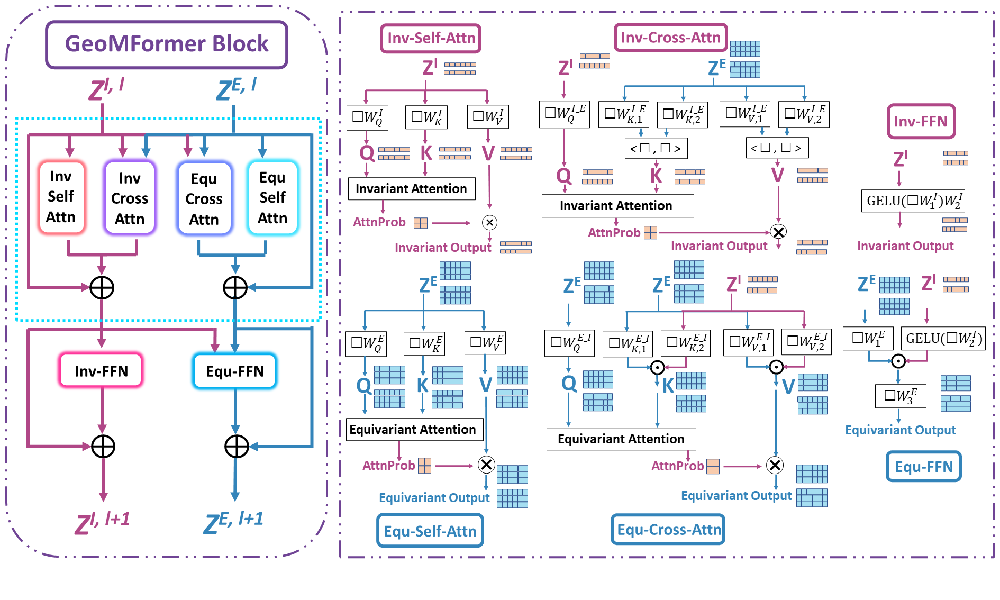
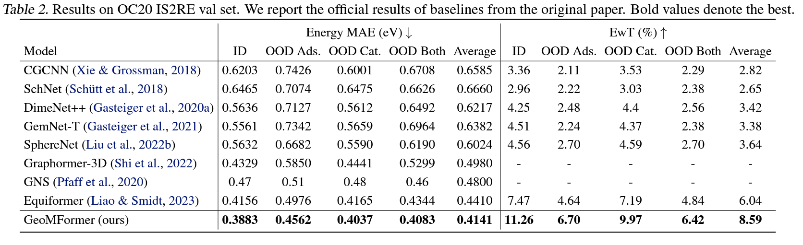
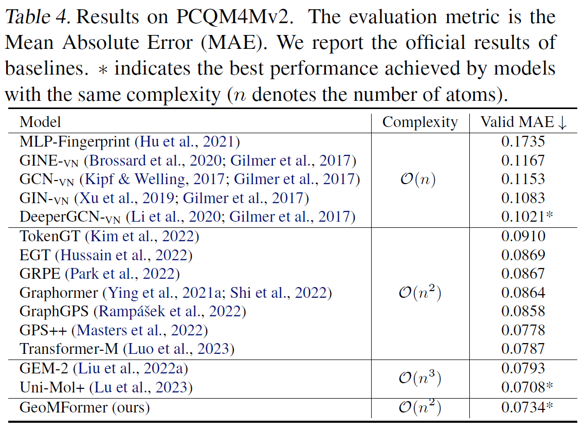
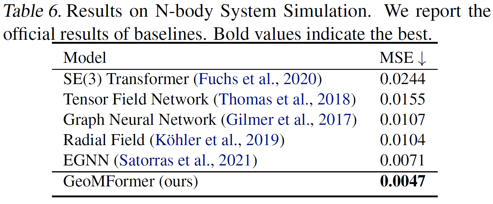

## GeoMFormer: A General Architecture for Geometric Molecular Representation Learning

This repo is the official implementation of **[GeoMFormer: A General Architecture for Geometric Molecular Representation Learning](https://openreview.net/forum?id=Y5Zi59N265)**, which was presented at ICML 2024.

> GeoMFormer: A General Architecture for Geometric Molecular Representation Learning
>
> Tianlang Chen\*, Shengjie Luo\*, Di He, Shuxin Zheng, Tie-Yan Liu, Liwei Wang
>
> Contact: Tianlang Chen (chentl@stanford.edu), Shengjie Luo (luosj@stu.pku.edu.cn)


## Overview


We developed GeoMFormer, a Transformer-based geometric molecular model, capable of effectively making both invariant and equivariant predictions with high accuracy. By simultaneously and comprehensively modeling interatomic interactions within and across feature spaces in a unified manner, GeoMFormer demonstrates strong performance across diverse data modalities, scales, and tasks. 


## Main Results

We empirically investigate the performance of GeoMFormer across a range of extensive tasks. Below, we present a selection of these tasks. For complete results, please refer to the full paper.


### OC20 IS2RE Performance (Invariant)




### PCQM4Mv2 Performance (Invariant)




### N-Body Simulation Performance (Equivariant)




## Citation
If you find our work useful, please consider citing it:
```
@inproceedings{
chen2024geomformer,
title={Geo{MF}ormer: A General Architecture for Geometric Molecular Representation Learning},
author={Tianlang Chen and Shengjie Luo and Di He and Shuxin Zheng and Tie-Yan Liu and Liwei Wang},
booktitle={Forty-first International Conference on Machine Learning},
year={2024},
url={https://openreview.net/forum?id=Y5Zi59N265}
}
```
